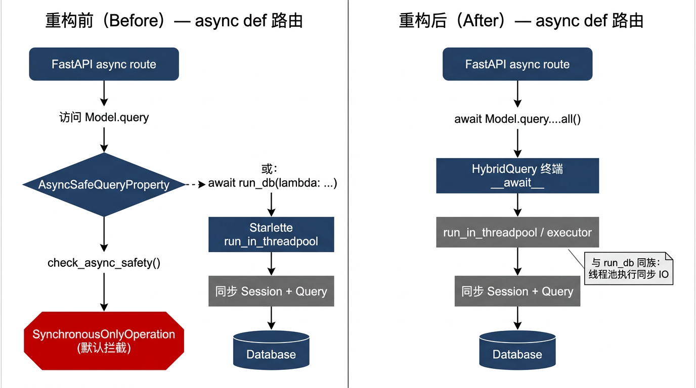
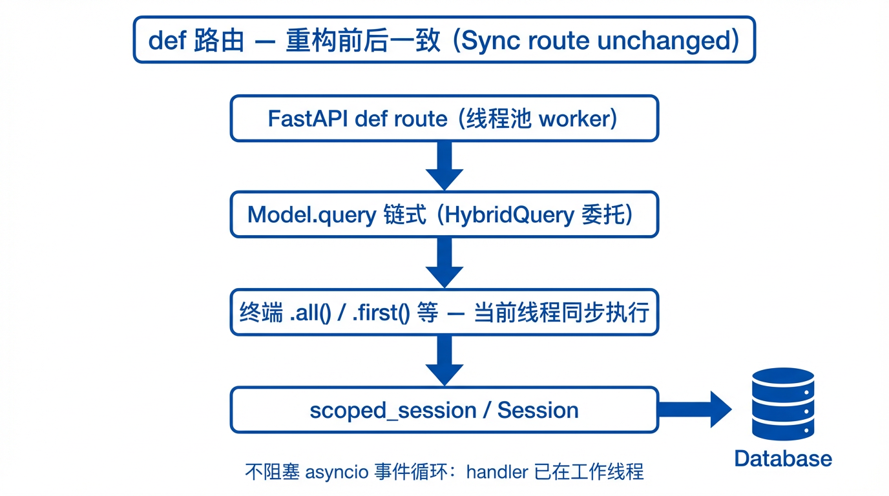
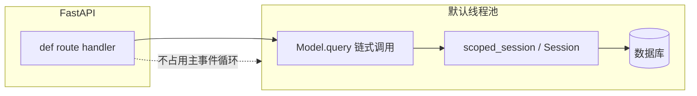
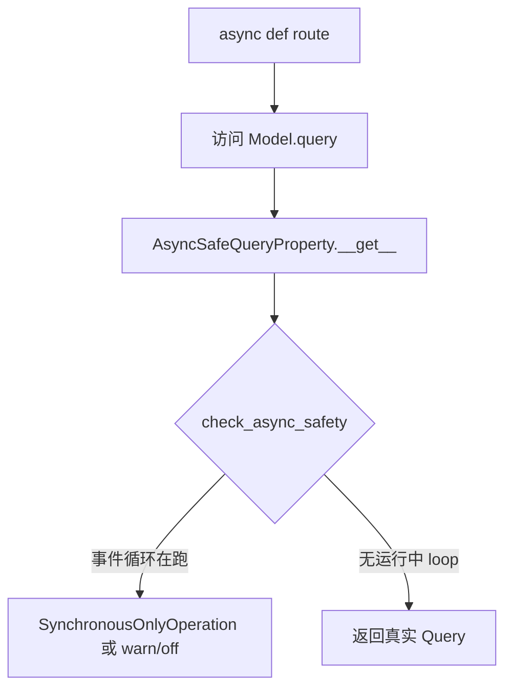
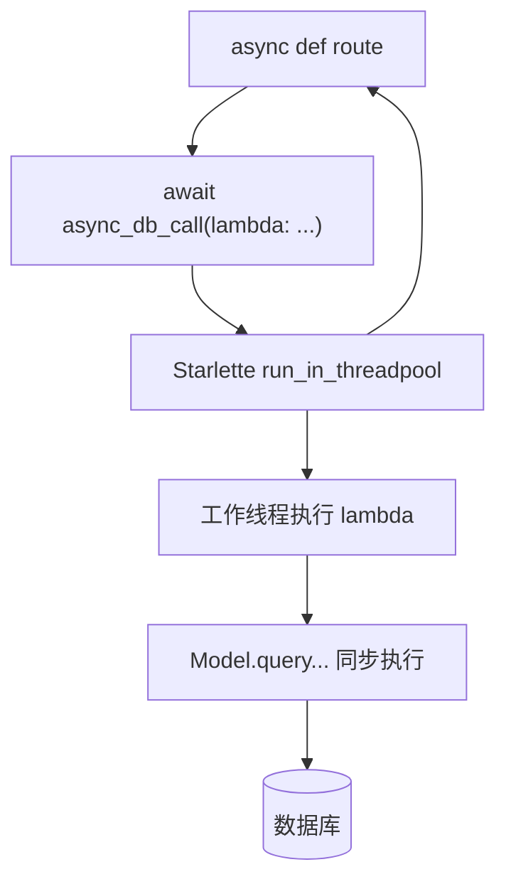
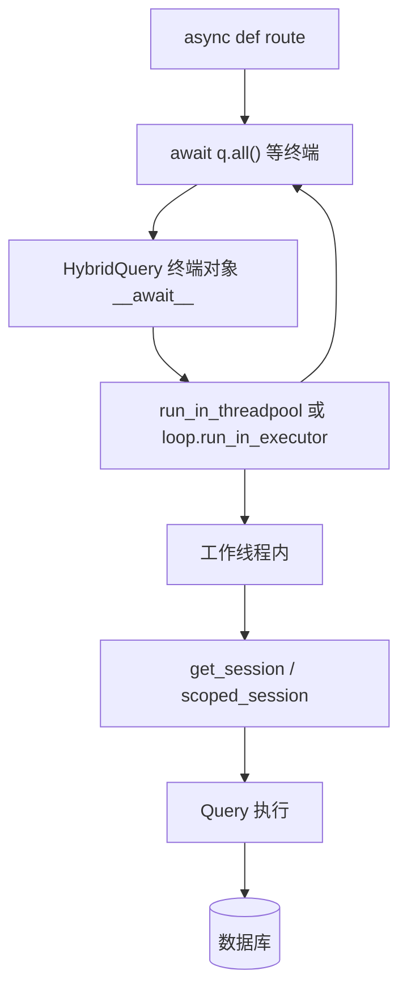
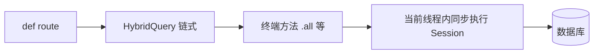
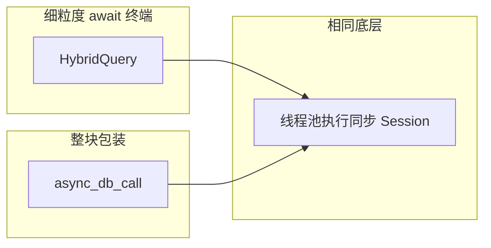
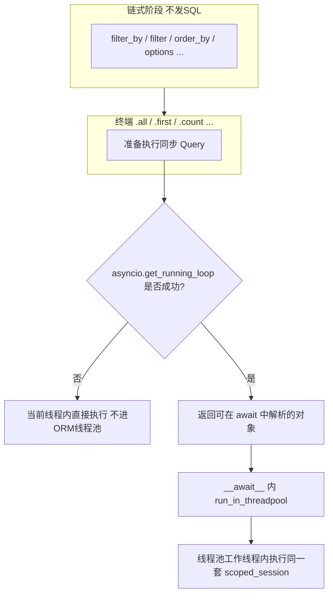
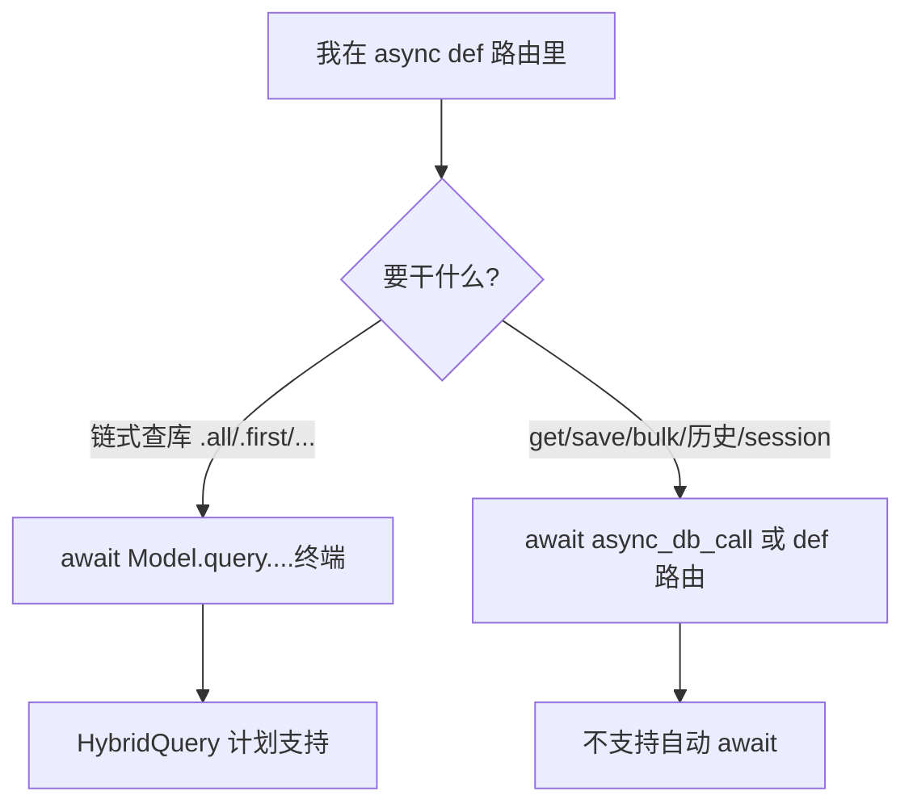

# 22. HybridQuery：同步/异步统一查询 API（重构设计文档）

> **文档性质**：设计与实施参考，供后续在 `yweb-core` 中落地重构时使用。  
> **状态**：设计已定稿；代码实现以仓库内 `yweb/orm` 实际为准。
>
> **命名备注（2026-04-21 更新）**：本文正文统一使用 `async_db_call(...)` 作为正式名称；
> 本文档早期稿以及部分未迁移的上游项目中，这一工具仍可能以旧名 **`run_db(...)`** 出现。
> 按 23 号清单 D5 决策，正式名统一为 **`async_db_call`**；`run_db` 作为 `DeprecationWarning`
> 级别的向后兼容别名保留一个发布周期。阅读本文时可将两者视为同一工具（线程池薄封装），
> 新代码请一律使用 `async_db_call`。

## 1. 背景与目标

### 1.1 现状

- ORM 基于 **SQLAlchemy 同步** `Session` + `scoped_session`。
- `CoreModel.query` 由 `scoped_session.query_property()` 提供，本质是同步 `Query`。
- 在 **`async def` 事件循环线程** 上直接执行同步 IO 会阻塞事件循环，故引入：
  - **`AsyncSafeQueryProperty`**：在访问 `Model.query` 时调用 `check_async_safety()`，默认抛 `SynchronousOnlyOperation`。
  - **`async_db_call(func)`**：用 Starlette `run_in_threadpool` 把整块同步 DB 逻辑放到线程池执行。

外部项目（如 `y-sso-system`）中大量 `async def` 路由被迫写成：

```python
apps = await async_db_call(lambda: application_model.query.filter_by(is_active=True).all())
```

### 1.2 目标

在 **不分裂两套 API** 的前提下，让用户可以这样写：

| 场景 | 期望写法 | 期望结果 |
|------|----------|----------|
| `def` 路由 | `apps = Model.query.filter_by(...).all()` | 直接得到 `list`，与现在一致 |
| `async def` 路由 | `apps = await Model.query.filter_by(...).all()` | 同样得到 `list`，底层自动线程池化，不阻塞事件循环 |

同时保留 **`async_db_call()`** 作为兼容与细粒度控制手段。

### 1.3 非目标（本方案不承诺）

- 将全栈改为 **原生 AsyncSession + asyncpg**（与现有 `scoped_session`、软删除重写、历史版本等耦合深，另立项目级迁移）。
- 让 **`cls.query.session.execute(...)`** 在 `async def` 里“自动 await”（Session 级 API 仍建议 `async_db_call` 或 `def` 路由）。

---

## 2. 重构前后对比（流程层面）

### 2.1 可视化对比图（PNG）

以下图片与本文 **§3、§4** 文字说明一致，便于快速对齐“谁调谁、何时进线程池”。

| 文件 | 说明 |
|------|------|
| [assets/hybrid_query_refactor_before_after.png](assets/hybrid_query_refactor_before_after.png) | **async 路由**：重构前（拦截 / `async_db_call`）与重构后（`await` + HybridQuery）对照 |
| [assets/hybrid_query_sync_route_unchanged.png](assets/hybrid_query_sync_route_unchanged.png) | **def 路由**：重构前后均为同步执行，行为保持 |

**async 路由：重构前 vs 重构后（PNG）**



**def 路由：重构前后一致（PNG）**



### 2.2 对照表（行为）

| 维度 | 重构前 | 重构后 |
|------|--------|--------|
| `def` 路由中 `Model.query...all()` | 同步 Query，在线程池内执行（FastAPI） | **不变**：仍同步执行 |
| `async def` 中裸调 `Model.query` | 访问 query 即可能触发 **`SynchronousOnlyOperation`** | **`await` 终端方法** 时由 HybridQuery 调度线程池 |
| `async def` 中写 DB | 必须 `async_db_call(lambda: ...)` 或改 `def` 路由 | 可对链式查询 **`await .all()` / `.first()` 等**；复杂块仍可用 `async_db_call` |
| `Model.query.session.*` | 经真实 `Query.session` | HybridQuery 对 **`session` 属性显式透传** 真实 `Session`（见 §5） |

---

## 3. 重构前：详细流程（原理）

### 3.1 `def` 路由（当前即正确路径）



要点：同步路由在 **工作线程** 中跑，阻塞的是线程而非 asyncio 事件循环。

### 3.2 `async def` 路由 + 直接访问 `Model.query`（当前默认会失败）



要点：`get_running_loop()` 成功即认为在 **事件循环线程**，同步 DB 会伤害并发，故默认拦截。

### 3.3 `async def` + `async_db_call`（当前推荐补救）



要点：**整块**同步逻辑进线程池；`ContextVar`（如 `request_id`）需与现网一致，以便同请求共享 `scoped_session`。

---

## 4. 重构后：HybridQuery 方案（原理）

### 4.1 核心思想

- **`Model.query` 不再** 在“访问 query 属性”这一刻做 `check_async_safety()`（或仅保留极窄场景）。
- 改为返回 **`HybridQuery` 代理**：对链式方法 **委托** 内部真实 SQLAlchemy `Query`，对 **终端操作** 同时支持：
  - **同步**：直接在当前线程执行（与现在 `Query` 一致）；
  - **异步**：`await` 时通过 **`run_in_threadpool`（或等价）** 在同套 `scoped_session` 语义下执行，避免阻塞事件循环。

> **本质**：不是把数据库变成异步 IO，而是把 **“执行这条 Query”** 从事件循环线程挪到线程池——与 `async_db_call` 同族，只是粒度变成 **终端方法**。

### 4.2 `async def` + `await Model.query....all()`（目标路径）



### 4.3 `def` 路由（重构后仍应不变）



### 4.4 与 `async_db_call` 的关系



### 4.5 推荐落地：「只有 async 才走线程池」的最小方案（与诉求对齐）

若目标是：**改动尽量小**、**只在 `async def` 里用 `await` 时才进线程池**、**同步代码路径不额外包一层 ORM 线程池**——**当前文档中的 HybridQuery 即这一条「完美」落地方案**（在约束清晰的前提下）。下面把规则写死，便于实现与 Code Review。

#### 4.5.1 三条硬规则

| 规则 | 内容 |
|------|------|
| **R1** | **线程池只服务于「在事件循环线程上执行 Query 终端」**。实现上：终端对象实现 `__await__`，内部调用 **`run_in_threadpool`（与现有 `async_db_call` 同源）** 执行「构建好的同步 `Query` 的一次执行」。 |
| **R2** | **无运行中事件循环时，终端必须同步执行、且不进 ORM 自建的线程池**。典型场景：`def` 路由（FastAPI 已把整 handler 放进工作线程，该线程上通常 **`get_running_loop()` 失败**）、脚本、单测。这样避免 **「def 路由 + ORM 再进池」的双重调度**。 |
| **R3** | **链式方法**（`filter_by` / `filter` / `order_by` / `options` …）只做 **惰性组合**，不发 SQL；可在 **任意上下文同步调用**，不进线程池。 |

#### 4.5.2 行为与调用方式（用户侧「一种 API」）

```python
# 同步上下文（def 路由、脚本等）：与现在一致，直接拿结果，ORM 层不进线程池
def list_apps():
    return application_model.query.filter_by(is_active=True).all()

# 异步上下文（async def 路由）：必须 await 终端，ORM 层在此处进线程池一次
async def list_apps():
    return await application_model.query.filter_by(is_active=True).all()
```

写库、Session 级操作、类方法封装查询：**仍用** `await async_db_call(lambda: ...)` 或 **`def` 路由**（§5、§8 已说明原因）；本方案 **不** 为省这几行去动整个 `CoreModel`。

#### 4.5.3 决策流程（实现时对照）



#### 4.5.4 代码改动面（保持最小）

| 项 | 说明 |
|----|------|
| **新增** | `yweb/orm/hybrid_query.py`（HybridQuery / 终端 await 对象） |
| **改** | `db_session.py`：`init` 里把 `CoreModel.query` 从 `AsyncSafeQueryProperty` 换为 HybridQuery 描述符 |
| **改** | `async_safety.py`：**取消**「访问 `query` 即 `check_async_safety`」；**保留** `db_manager.get_session()` 等处检测（写路径仍安全） |
| **不改** | `core_model.py` 中 `save` / `bulk_*` / 历史等实例与类方法（继续 `async_db_call` 或 `def`） |
| **保留** | `async_db_call` 原样可用 |

#### 4.5.5 为何这就叫「完美」

- **语义**：与 FastAPI 一致——**同步 handler 不占事件循环**；**异步 handler 里只有 `await` 的查询终端才进池**。  
- **改动**：集中在 **`query` 入口 + 异步安全策略** 两处，不动大体量 CRUD。  
- **风险**：比「CoreModel 全局包线程池」可控得多（§8.5）。  

> **注意**：在 `async def` 里若写了 `x = Model.query....all()` 却 **忘记 `await`**，会得到「可等待对象」而非列表，易在运行期暴露；应在文档与 linter 习惯上强调 **`async` 里查询必须 `await` 终端**。

---

## 5. 覆盖范围与特殊规则

本节依据 [`core_model.py`](../../yweb/orm/core_model.py) 源码逐项核对：**HybridQuery 只替换「类上的 `Model.query` → SQLAlchemy `Query` 链」**；`CoreModel` 上其余方法大多直接走 **`self.session` / `cls.query.session`**，**不在** HybridQuery 的 `await` 自动化范围内。

### 5.0 图例（async def 路由下「能否无 `async_db_call`」）

| 标记 | 含义 |
|------|------|
| **✅ 计划支持** | 通过 **`await Model.query....<终端>`**（HybridQuery）在实现后应能安全用于 `async def`，底层线程池执行同步 Query。 |
| **⚠️ 条件/额外工作** | 部分路径可支持，或存在懒加载等边界，需在实现与测试中单独约定。 |
| **❌ 不支持** | 非 `Model.query` 链终端；在 **`async def` 中直接调用仍会阻塞事件循环**（或触发 `get_session` 的 async 安全检测）。须 **`def` 路由**、**`await async_db_call(...)`** 或 **`with_db_session` / `@with_db_session`**。 |
| **— 非 DB** | 通常不访问数据库；或仅为纯 Python 数据结构操作。 |

> **`def` 路由**：下表中凡涉及同步 Session 的方法均可像今天一样使用（handler 已在线程池内），不单独重复标注。

### 5.1 `Model.query`：SQLAlchemy `Query` 链（HybridQuery 主战场）

#### 5.1.1 链式方法（返回可继续链式的对象）

| 方法 / 模式 | async `await` 支持 | 说明 |
|-------------|---------------------|------|
| `filter` / `filter_by` | **✅ 计划支持** | 返回新 HybridQuery，继续链式。 |
| `order_by` | **✅ 计划支持** | 同上。 |
| `limit` / `offset` | **✅ 计划支持** | 同上。 |
| `options`（如 `joinedload`） | **✅ 计划支持** | 同上。 |
| 其它「返回 `Query`」的 API | **✅ 计划支持** | 建议 **`__getattr__` 委托** 内部真实 `Query`，返回值一律再包成 HybridQuery；需在集成测试中扫常见用法。 |

#### 5.1.2 终端方法（执行 SQL 并返回结果）

| 方法 | async `await` 支持 | 说明 |
|------|---------------------|------|
| `all` | **✅ 计划支持** | 目标用法：`await Model.query....all()`。 |
| `first` | **✅ 计划支持** | |
| `one` / `one_or_none` | **✅ 计划支持** | 项目若少用，仍建议实现以与 SQLAlchemy 一致。 |
| `scalar` / `scalars`（若通过 Query 暴露） | **✅ 计划支持** | 按实际 SQLAlchemy 版本与用法覆盖。 |
| `count` | **✅ 计划支持** | |
| `get`（Query 上的主键 get，若仍使用） | **✅ 计划支持** | SA 2.0 中部分场景已弃用，但现网若有则需代理。 |
| `delete`（`Query.delete()`） | **✅ 计划支持** | 如 `RolePermission` 等 `cls.query.filter_by(...).delete()`。 |
| `update`（`Query.update()`，若使用） | **✅ 计划支持** | 同上，委托 + 终端 await。 |
| `paginate`（挂在 `Query` 上的扩展） | **⚠️ 需单独适配** | `CoreModel._add_paginate_to_query` 注入；内部含 `count` + `slice`，应对齐同步/await 语义并单测。 |

**实现要点**（2026-04-21 定稿，见 23 号清单 Phase 3.3）：终端方法在**同步上下文**立即求值返回原生结果（`list` / Model / `int` / `Page`）；在 **async 上下文**返回 `_HybridTerminal`（可 `await`）。用户在 async 中忘 `await` 时拿到的是 `_HybridTerminal` 对象，下一行操作（迭代 / 索引 / 属性访问）自然触发 `TypeError`，避免静默阻塞事件循环。不对外暴露 `.value()` / `.result()` 公开同步入口（`_HybridTerminal._run_sync()` 作为下划线 escape hatch）；写终端（`delete` / `update`）与读终端走同一策略。

#### 5.1.3 `Model.query.session`（属性透传）

| 访问 | async `await` 支持 | 说明 |
|------|---------------------|------|
| `Model.query.session` | **❌ 不支持「自动 await」** | 必须返回 **真实 `Session`**，以兼容 `core_model` / 缓存等处的 `cls.query.session.execute` / `commit` / `merge`。在 **`async def` 里调用 `session.execute` 等仍会阻塞**，须 `async_db_call` 或 `def` 路由。 |

兼容示例（须继续工作）：

```text
cls.query.session.add_all(...)
cls.query.session.execute(...)
cls.query.session.scalar(...)
cls.query.session.commit()
... query.session.merge(...)
```

---

### 5.2 `CoreModel` 实例属性与实例方法（非 `Model.query` 链）

| 成员 | async 无 `async_db_call` | 主要 DB 路径（源码依据） | 说明 |
|------|-------------------|-------------------------|------|
| `session`（property） | **❌** | `__class__.query.session` 或 `db_manager.get_session()` | 取 Session 后其上的 `add/commit/execute` 均为同步 IO。 |
| `save` | **❌** | `self.session.add` + `commit`/`flush` | |
| `add` | **❌** | 同 `save` | 别名。 |
| `update` | **❌** | `session` + `commit` | |
| `delete` | **❌** | `self.session.delete` | |
| `refresh` | **❌** | `self.session.refresh` | |
| `update_properties` | **❌** | 委托 `update` | |
| `update_with_foreign_key_none` | **❌** | `session` + `commit` | |
| `get_history` | **❌** | `history_helper` + `self.session` | |
| `history`（property） | **❌** | `get_history` | |
| `history_count`（property） | **❌** | `get_history_count` + `self.session` | |
| `get_history_diff` | **❌** | `history_helper` + `self.session` | |
| `get_field_text_diff` | **❌** | 同上 | |
| `restore_to_version` | **❌** | 同上 | |
| `to_dict` | **—** | 通常仅列属性 | **⚠️** 若关系未预加载，后续在模板/序列化中访问关系可能 **隐式懒加载** → 等同同步 DB。 |
| `to_dict_with_relations` | **⚠️** | 读关系属性 | 易触发懒加载；async 中建议先 `await` 查好带 `options` 的数据再序列化。 |
| `detach` | **❌** | `object_session` / `expunge` / `make_transient_to_detached` | |
| `detach_with_relations` | **❌** | 同上 + 关联 | |

#### 5.2.1 为何 §5.2 / §5.3 里大量是「不支持」？—— 根因不是「做不到」，而是 **切入口不同**

1. **HybridQuery 只接管一条入口**  
   设计目标是在不拆两套 API 的前提下，让 **`Model.query → … → 终端`** 这条 **SQLAlchemy `Query` 链** 在 `async def` 里可以 **`await` 终端**。  
   实现上等于：在「执行这条 Query」的瞬间把同步调用 **丢进线程池**（与 `async_db_call` 同族）。

2. **实例方法 / 多数类方法根本不经过 `Model.query` 链**  
   `save` / `delete` / `refresh` / `get_history` 等走的是 **`self.session` 或 `cls.query.session`**，直接调用 **同步 `Session` API**（`add` / `delete` / `commit` / `execute` / `refresh` …）。  
   它们 **没有**「链式 Query 对象」这一层，因此 **天然不在 HybridQuery 的包装范围内**。若要对它们也「无感 await」，等价于 **再给整条 Session 使用面加一层异步门面**，工作量与风险远大于只包 Query。

3. **即便技术上能包，语义也更难保证**  
   - `save(commit=True)` 涉及 **事务边界、flush、乐观锁、软删除钩子、历史版本** 等，与「单次只读查询」不同。  
   - 若对每个实例方法都做 `await` 包装，本质上仍是 **每次调用 `run_in_threadpool`**，与 **`await async_db_call(lambda: user.save(True))`** 相同量级，但会 **分散隐式线程跳转**，排错更难。

因此：§5.2 / §5.3 标 **❌** 的含义是 **「本 HybridQuery 方案不承诺自动 await」**，不是「永远不能用在 async 应用里」——用 **`def` 路由、`async_db_call`、或 `with_db_session`** 即可。

#### 5.2.2 有没有「更好」的支持方式？—— 可选演进（按投入与风险排序）

| 方案 | 做法概要 | 优点 | 缺点 / 风险 |
|------|----------|------|-------------|
| **A. 架构约定（推荐作为默认）** | **写路径** 用 `def` 路由或 `async_db_call` 包一整段业务；**读路径** 用 `await Model.query...` | 与 FastAPI 官方建议一致；事务清晰；改动面最小 | 开发者需记住「读 / 写」分流 |
| **B. 继续用好现有工具** | `async_db_call`、`with_db_session`、`@with_db_session` | 已存在、语义明确 | 样板代码比「裸 await」略多 |
| **C. Service / 用例级封装** | 在 Service 层提供 `async def create_user(...)`，内部 **`await async_db_call(lambda: ...)`** 一次包全段 | 路由层干净；事务在一个 lambda 内 | 需维护 Service API |
| **D. 显式双 API** | 为少数高频方法增加 `save_async` / `get_async` 等，内部线程池 | 调用点意图清晰 | API 数量翻倍、文档与测试成本上升 |
| **E. 元类 / 装饰器批量包装** | 扫描 `CoreModel` 的「DB 相关」方法，统一包一层线程池 | 表面上「全能 await」 | 难界定哪些方法该包；调试栈变深；与 `inspect`、类型提示易冲突 |
| **F. 迁移 AsyncSession** | 引入 `create_async_engine` + `AsyncSession`，读写全走 async | 真正意义上的异步 IO（在驱动支持的前提下） | **与现有 `scoped_session`、软删除重写、历史、事务管理器** 等深度耦合，属于 **另一次大版本迁移**，不是 HybridQuery 的增量补丁 |

**结论**：  
- **HybridQuery** 解决的是 **「读模型、链式查询」在 async 路由里的体验**（与 Django QuerySet await、SQLAlchemy「同构查询不同 Session 执行」的思路对齐，但底层仍是线程池 + 同步 Session）。  
- **写模型、Session 级操作** 更合理的「更好方案」通常是 **A + B + C**（约定 + 现有工具 + 用例级 `async_db_call`），而不是强行让 `save`/`delete` 等每一个实例方法都变成可 `await` 的魔法（除非走 **F** 做全栈 async ORM）。

---

### 5.3 `CoreModel` 类方法（非 `Model.query` 显式链）

| 方法 | async 无 `async_db_call` | 主要 DB 路径 | 说明 |
|------|-------------------|-------------|------|
| `save_all` | **❌** | `cls.query.session.add_all` | |
| `add_all` | **❌** | 同上 | 别名。 |
| `delete_all` | **❌** | `cls.query.session.delete` | |
| `update_all` | **❌** | `cls.__cls_commit` → `cls.query.session.commit` | |
| `refresh_all` | **❌** | `cls.query.session.refresh` | |
| `get` | **❌** | `cls.query.filter_by(id=...)` 再 `count`/`first` | **注意**：这是 **类方法封装**，不是 `await Model.query...`；本方案 **不自动** 为 `Model.get(id)` 生成 await 版，async 中请 `async_db_call(lambda: Model.get(id))` 或先 `await Model.query.filter_by(id=id).first()`。 |
| `get_list_by_conditions` | **❌** | `cls.query.filter_by(...).all` | 同上。 |
| `get_all` | **❌** | `cls.query.all` | 同上。 |
| `get_history_by_id` | **❌** | `cls.query.session` 或传入 `session` | |
| `get_history_count_by_id` | **❌** | 同上 | |
| `paginate`（classmethod） | **⚠️** | `Query` 分支：`query.count` / `offset`/`limit`；`Select` 分支：`cls.query.session.execute` / `scalar` | **Query** 子路径可由 HybridQuery 覆盖；**Select** 子路径仍走 Session，async 须整体 `async_db_call` 或拆查询为 `await Model.query...`。 |
| `bulk_update` | **❌** | `cls.query.session.execute(update...)` | |
| `bulk_update_by_ids` | **❌** | 同上 | |
| `bulk_delete` | **❌** | `cls.query.session.execute(delete...)` | |
| `bulk_delete_by_ids` | **❌** | 同上 | |
| `bulk_soft_delete` | **❌** | 委托 `bulk_update` | |
| `bulk_soft_delete_by_ids` | **❌** | 委托 `bulk_update_by_ids` | |
| `cleanup_soft_deleted` | **❌** | `cls.query.session.execute(delete...)` | |
| `cleanup_all_soft_deleted` | **❌** | 遍历子类 + 上述 execute | |
| `get_soft_deleted_count` | **❌** | `cls.query.session.query(...).filter` | |

**内部/钩子（一般不直接给业务 await）**：`__is_commit` / `__cls_commit`、`_should_suppress_commit` / `_cls_should_suppress_commit`、`_check_history_enabled`、`_add_paginate_to_query` — 不单独列表；其触发的仍是同步 Session。

**特殊**：`__getattribute__(id)` 在 pending 时可能 **`session.flush()`** — **❌** 在 async 中访问未落库实例的 `id` 可能触发同步 IO，宜在 `async_db_call` 内完成 `save`/flush。

---

### 5.4 子类常见扩展（`base_model.py`）

[`base_model.py`](../../yweb/orm/base_model.py) 中业务子类常用：

| 方法 | async 无 `async_db_call` | 说明 |
|------|-------------------|------|
| `get_by_name` | **❌** | 内部 `cls.query.filter_by(name=...).first()`，类方法封装，非 `await Model.query` 语法。 |
| `get_by_code` | **❌** | 同上。 |

---

### 5.5 汇总：开发者该怎么选 API



- **✅ 计划由 HybridQuery 覆盖**：仅 **`Model.query` 起点** 的 SQLAlchemy **Query 链 + 终端**（见 §5.1）。
- **❌ 其余 `CoreModel` / `BaseModel` API**：在 **`async def` 中须 `async_db_call`、改为 `def` 路由，或 `with_db_session`**；本方案 **不** 承诺为每个类方法生成 async 变体。

---

## 6. 涉及文件（实施清单）

| 文件 | 变更要点 |
|------|----------|
| `yweb/orm/hybrid_query.py` | **新增** `HybridQuery`（及必要的终端 await 类型） |
| `yweb/orm/db_session.py` | `init_database` / `DatabaseManager.init` 里设置 `CoreModel.query = ...` |
| `yweb/orm/async_safety.py` | 调整：不再通过 `AsyncSafeQueryProperty` 在 **query 访问** 时拦截；可保留 `check_async_safety` 供 `get_session` 等使用 |
| `yweb/orm/__init__.py` | 视需要导出 |
| 测试 | 覆盖：`def` 路由行为不变；`async def` + `await` 终端；`query.session.*`；与 `async_db_call` 共存 |
| 文档 | 更新 `12_db_session.md`、`15_fastapi_integration.md` 指向本设计 |

---

## 7. 风险与测试要点

### 7.1 通用风险

1. **重复执行 / 惰性求值**：终端对象是“延迟执行”还是“立即执行”，需与 **多次 await、多次迭代** 语义对齐（建议单次执行缓存结果或明确文档禁止复用）。
2. **`paginate`**：涉及 `count` + `slice`，应单独集成测试。
3. **类型检查**：`TYPE_CHECKING` 下 `CoreModel.query` 类型可标为联合或 Protocol，避免 IDE 误报。
4. **Starlette 版本**：`run_in_threadpool` 行为与上下文传播需与现网一致。

### 7.2 Session 生命周期与连接池泄漏（HybridQuery 落地的核心风险）

> **核心命题**：HybridQuery 让 `async def` 里也能直接 `await Model.query....all()`，**不改变**底层「同步 `Session` + `scoped_session` + `request_id` 绑定 + `on_request_end()` 清理」的契约。一旦 **清理入口缺失** 或 **Session 被跨线程/跨协程共享**，`scoped_session` 的 registry 会持有 `Session` 不放，连接池最终 `QueuePool TimeoutError`。重构期 **必须** 把下列场景逐一演练与测试。

#### 7.2.1 风险场景矩阵

| 场景 | 风险 | 解法 |
|------|------|------|
| `async def` 路由 + `RequestIDMiddleware` 正常挂载 | 无泄漏，中间件 `finally` 调 `on_request_end()` → `session_scope.remove()` | **现状即可**；保持 `RequestIDMiddleware` 为纯 ASGI 实现（勿换成 `BaseHTTPMiddleware`，会丢 ContextVar）。 |
| `async def` 路由 + **无中间件** | 泄漏：`request_id` 可能永不推进、Session 不 `remove()`，scoped registry 积累 | **必须挂载 `RequestIDMiddleware`**；或在路由 `finally` 里显式 `on_request_end()`；或改 `def` + `Depends(get_db)`。 |
| `asyncio.gather(await q1.all(), await q2.all(), ...)` 并发多终端 | 同一请求 `request_id` → 同一 `Session`；多个线程池线程并发读写同一 `Session` **非线程安全**（SA 明确禁止） | **文档明确禁止**在同一请求内并发触发终端 await；若确有并发需求，为每个分支用独立 `await async_db_call(lambda: with db_session_scope(request_id=...): ...)` 拿到独立 Session；或改串行 `await`。 |
| 脚本 / 定时任务 / CLI 里 `await 终端` | 泄漏：没有 `RequestIDMiddleware`，也没有上下文管理器负责 `remove()` | 必须用 **`@with_db_session` 装饰器** 或 **`with db_session_scope():`** 包裹入口；HybridQuery 不负责兜底清理。 |
| 终端执行抛异常 / 客户端提前断开 | 中间件 `finally` 必须在异常/断连下仍能执行 `on_request_end()` | 纯 ASGI 的 `RequestIDMiddleware` 当前用 `try/finally` 覆盖；**测试必须覆盖** 抛异常、`asyncio.CancelledError`（客户端断开）两条路径。 |
| 多次 `await` 同一终端对象 | 重复发 SQL、结果语义混乱；惰性实现下可能产生分离实例 | 终端对象 **一次性**：`__await__` 执行后内部标记 consumed，再次 `await` 抛 `RuntimeError`；参见 §7.1 第 1 条。 |
| `await Model.query....all()` 与 `async_db_call(lambda: Model.query....all())` 混用 | `async_db_call` 与 HybridQuery 终端都走 `run_in_threadpool`；在同一 `request_id` 下串行即正确，并发则回到第 3 条 | 约定：同一请求内 **串行** 使用；禁止在 `asyncio.gather` 里混跑多个 DB 终端/`async_db_call`。 |
| `await q.count(); await q.all()` 链式复用 | 若 HybridQuery 把链式与终端耦合在同一对象，多次调用终端可能踩「一次性」约束 | 实现上 **链式返回新 HybridQuery，终端返回一次性终端对象**；两者分离，避免误伤链式复用。 |

#### 7.2.2 与 `on_request_end()` / `scoped_session` 的契约

落地 HybridQuery **不得**破坏下列既有契约（均已在 `db_session.py` / `RequestIDMiddleware` 实现）：

1. **`request_id` 为 scopefunc**：`scoped_session(session_maker, scopefunc=_get_request_id)`；同一请求内任意线程池线程拿到的都是**同一个 `Session`**。  
2. **锁定语义**：`get_session()` 创建 Session 后锁定 `request_id`；HybridQuery 的终端在 `run_in_threadpool` 内触发 `Model.query` 时仍走 `scoped_session()`，线程池线程需通过 `contextvars.copy_context()`（Starlette `run_in_threadpool` 已做）继承父协程的 `request_id`，否则会拿到空 ID 并**新建一个 Session**，形成泄漏。  
3. **幂等清理**：`on_request_end()` / `db_manager.cleanup()` 多次调用安全；`RequestIDMiddleware.finally` 与 `get_db()` 可并存。HybridQuery **不要** 在终端对象里偷偷加 `remove()`，清理必须留给中间件 / 上下文管理器。  
4. **事务边界不在 HybridQuery 里**：终端默认不 `commit`；写路径请继续走 `save / bulk_* / with_db_session / db_session_scope`，在入口统一 `commit/rollback`。

#### 7.2.3 强制测试清单（与 §6 实施清单对齐）

- [ ] `async def` 路由 + `await Model.query....all()` ×N 串行 → 连接池占用回落到 0。  
- [ ] `async def` 路由抛异常 → 中间件 `finally` 仍调用 `on_request_end()`；`scoped_session.registry.has()` 为 `False`。  
- [ ] 客户端断开（ASGI `CancelledError`）→ 同上。  
- [ ] **无中间件** 场景：跑一个不挂 `RequestIDMiddleware` 的最小 app，断言「`async def` 里用 HybridQuery → 泄漏可见」作为反例测试，提醒用户必须挂中间件。  
- [ ] `asyncio.gather` 同一请求并发多终端：写成单测用 `pytest.warns` / 日志断言或直接 `pytest.raises`，**文档 + 代码层面同时拒绝**。  
- [ ] 脚本入口：`with db_session_scope(): await q.all()` 与 `@with_db_session async def f(): await q.all()` 均无泄漏。  
- [ ] 终端对象二次 `await` → 抛明确异常（`RuntimeError("HybridQuery terminal already consumed")` 或类似）。  
- [ ] 连接池压力测试：固定 `pool_size` + `max_overflow`，跑 N 轮 `async` 请求，结束后 `engine.pool.checkedout() == 0`。

### 7.3 HybridQuery 实现与集成的其他踩坑点

> §7.2 聚焦 Session / 连接池生命周期；本节收集 HybridQuery 落地中**其他**容易在 review 与验收里漏掉的坑，按「危险程度 × 出现概率」分组，每条都给明确对策。实现 PR 需要逐项自检。

#### 7.3.1 懒加载在 `await` 出池后触发（最隐蔽）

- 场景：`rows = await Model.query.all()` 终端在线程池执行，结果返回事件循环线程后，再访问 `row.rel` / `row.rel.xxx` 会触发 **同步 lazy load**——此时代码已不在线程池里，会**直接在 async 线程上发 SQL，绕过所有 HybridQuery 检测**，阻塞事件循环。
- 触发点远不止业务代码：
  - FastAPI / Pydantic 的响应模型序列化（`response_model=UserSchema`）会逐字段 `getattr`；
  - `to_dict_with_relations`、模板渲染、日志 `repr(obj)`；
  - `Session` 默认 `expire_on_commit=True`（见 `db_session.py` sessionmaker 注释），commit 后**所有已加载属性也会失效**，再次访问即再次懒加载。
- **对策**（三条都要做）：
  1. HybridQuery 实现时 **不能** 改 `expire_on_commit`；文档显式说明「async 路由里 commit 后访问实例属性也会阻塞」。
  2. 约定：**async 路由一律先在终端里把需要的字段加载齐** —— `options(joinedload(...), selectinload(...))`，并在同一线程池回合里 `to_dict()` → 返回 dict / DTO，不要把 ORM 实例直接交给 FastAPI 序列化。
  3. CI 侧可选：开发期开启 `SQLAlchemy` 的 `sqlalchemy.engine.Engine` 日志 + 一个检测器——在事件循环线程上看到 `SELECT` 即 warn（和现有 `check_async_safety` 同源，但挂在 `before_cursor_execute` 事件上，覆盖面比 `query` 属性更广）。

#### 7.3.2 `DetachedInstanceError` / Session 过期后访问

- HybridQuery 终端执行完成后 Session **没被清理**（清理留给中间件），但**可能被其他 `async_db_call` / 终端**触发 commit / expire。再加上请求末尾 `on_request_end()` 会 `session_scope.remove()`，之前 `await` 拿到的实例如果被异步任务持有到请求结束之后（如 `BackgroundTasks`、`asyncio.create_task`），再访问就是 `DetachedInstanceError`。
- **对策**：文档明确「HybridQuery 返回的 ORM 实例生命周期 = 当前请求」；跨请求 / 后台任务必须提前 `to_dict()` 或 `detach()`；`BackgroundTasks` 里需要 DB 的，自己 `with db_session_scope(): ...`，**不要**复用外层请求的实例。

#### 7.3.3 线程池与 DB 连接池的容量对齐（最容易出生产故障）

- HybridQuery 每次终端 `await` 占用 **1 个 Starlette/AnyIO 线程池 token** + **1 个 DB 连接**。默认值互相不匹配时会造成 **连接池等待 → 线程池全部阻塞 → 事件循环假死**。
- 已知默认值：
  - AnyIO 默认线程池容量：`anyio.to_thread.current_default_thread_limiter().total_tokens`（通常 40）。
  - yweb 默认 DB：`pool_size=5, max_overflow=10`（见 `db_session.py`），上限 15。
- 典型故障：40 个并发 `async` 请求各 `await Model.query.all()`，15 个拿到连接后执行 SQL，另外 25 个在 `QueuePool.checkout()` **同步阻塞**一个线程池 worker 等连接，`pool_timeout=30s` 超时前整个进程吞吐塌陷。
- **对策**（任选）：
  1. 容量公式：`pool_size + max_overflow ≥ AnyIO token 数`，或反之把 AnyIO token 调小：  
     `anyio.to_thread.current_default_thread_limiter().total_tokens = pool_size + max_overflow`；
  2. 严格路由：`async def` 路由里只允许 **1 次** 终端 await / `async_db_call`，禁止「await 查 → 再 `async_db_call` 写」串行在同一 handler；
  3. 压测用例列入 §7.2.3：`concurrency = pool_size + max_overflow + 5` 时 p99 不应失控。

#### 7.3.4 SA `Query` 的**隐式终端**（易绕过 HybridQuery）

SA `Query` 除了 `.all() / .first() / .count()` 这些显式终端，还有若干「看着像链式、实则发 SQL」的入口。HybridQuery 必须**覆盖或显式禁止**，否则 async 路由里会裸跑同步 SQL：

| 用法 | 是否发 SQL | HybridQuery 处理 |
|------|-----------|------------------|
| `for row in query:` / `iter(query)` | ✅ 立即发 SQL（等同 `.all()`） | **禁用**：`__iter__` 抛 `RuntimeError("async 中请用 await query.all()")`；同步中透传。 |
| `query[0:10]` / `query[0]` | ✅ 发 SQL | 同上：`__getitem__` 要同步上下文检测，async 中要求改 `await query.limit(10).all()`。 |
| `bool(query)` | ✅ 发 SQL（SA 历史遗留） | `__bool__` 抛异常；推荐改 `await query.count() > 0` 或 `await query.exists().scalar()`。 |
| `print(query)` / `repr(query)` / `str(query)` | ❌ 仅生成 SQL 字符串 | 必须代理到底层 `Query.__repr__ / __str__`，否则调试体验崩。 |
| `query.exists()` / `query.subquery()` / `query.cte()` | ❌ 不发 SQL | 链式返回，HybridQuery 要把返回值当「非 Query」原样放出，不要再包一层。 |
| `query.session` | ❌ 属性 | §5.1.3 已约定透传真实 Session。 |
| `query.statement` / `query.column_descriptions` | ❌ 属性 | 透传。 |
| `query.yield_per(N)` + `for` | ✅ 流式发 SQL | 同 `__iter__` 禁用；大结果集建议走 `def` 路由或专门的 stream API（§7.3.9）。 |

#### 7.3.5 `lazy='dynamic'` 关系返回的 `AppenderQuery` 不经 HybridQuery

- 业务模型若用 `relationship(..., lazy='dynamic')`（或等价的动态集合），访问 `user.roles` 拿到的是 **`AppenderQuery`**（`Query` 子类），**不走 `Model.query`**，也就不被 HybridQuery 包装。async 里 `user.roles.filter(...).all()` 会同步发 SQL。
- **对策**：
  1. 仓库内用 `rg "lazy=['\"]dynamic['\"]"` 扫一遍，列成清单；
  2. 实现阶段可以**显式**把 `AppenderQuery` 也包一层 HybridQuery（`relationship` 的 `query_class=` 可指定子类）；
  3. 若不想扩大改动面，文档明示「async 中访问 `dynamic` 关系必须 `async_db_call`」。

#### 7.3.6 与 `TransactionManager` / 写事务边界

- yweb 的 `transaction_manager` 是**同步上下文管理器**：`with transaction_manager.begin(): ...`。它和 HybridQuery 的组合存在概念错配：
  - `with transaction_manager.begin(): await Model.query.all()` —— `with` 是同步的，`await` 又把执行丢进线程池。事务起止与查询发生在**两个线程**，虽然靠 `scoped_session` 仍是同一 Session，但一旦有人把事务边界改成 `async with` 或在 lambda 里嵌套，很难讲清。
  - HybridQuery **终端默认不 commit**；写事务仍需 `async_db_call(lambda: ...)` 或 `with_db_session`，在一个 callable 内包住 `begin → 查 → 改 → commit`。
- **对策**：明文「**任何写事务都不要跨 `await`**」；写路径一律用 `await async_db_call(lambda: ...)` 或 `@with_db_session`，把 `transaction_manager.begin()` 完整包进 lambda。

#### 7.3.7 `allow_sync()` 语义需同步更新

- 现状：`allow_sync()` 通过 `ContextVar` bypass `check_async_safety()`，既救 `get_session()` 也救 `AsyncSafeQueryProperty`。
- HybridQuery 落地后，`AsyncSafeQueryProperty` 被拿掉，`allow_sync()` **只剩** `get_session()` 一条路径生效。
- **对策**：`async_safety.py` 的 docstring 与 §12 文档都要改描述（从「`query` + `get_session` 双防」改成「仅 `get_session` 写路径防御；读路径由 HybridQuery 接管」）；保留 `allow_sync()` 给 FastAPI `lifespan`（启动时 `init_database` / `auto_sync_permissions` 等）。
- **Phase 5B.2 后续**：`db_session_scope()` 内部已自动 `with allow_sync():` 包裹整个 scope，async 脚本/定时任务可直接 `with db_session_scope(): ...` 用同步 ORM，无需手动再套 `allow_sync()`。用户语义：**「显式开 scope = 显式声明『这段代码段允许同步 DB 操作』」**。

#### 7.3.8 测试代码迁移（必须与 HybridQuery PR 同一批交付）

- `pytest-asyncio` 让 `async def test_` 跑在事件循环里；一旦 HybridQuery 上线：
  - 老测试若写 `rows = Model.query.all()`（没 `await`），在 async 测试里拿到的是**终端对象**，断言 `len(rows) == N` 会报类型错误；
  - 同步 fixture 内 `Model.query.all()` 仍正常（fixture 不在 event loop 线程）。
- **对策**：
  1. HybridQuery 的 PR **必须**同步扫 `tests/` 下所有 `async def test_` 里的 `Model.query`，要么改成 `await`，要么把测试标为 `def test_`；
  2. 新增一条单测断言「在 async test 里忘 `await` → 拿到 HybridQuery 终端对象」，反向兜住；
  3. CI 对 `AsyncORMWarning` / `SynchronousOnlyOperation` 的期望行为写成 `pytest.raises` / `pytest.warns`，避免误报当成真实 bug。

#### 7.3.9 其他碎片坑（汇总）

| 坑点 | 说明 / 对策 |
|------|-------------|
| **大结果集 / 流式** | HybridQuery 不提供 stream API；`.yield_per()` 的 `__iter__` 被禁用后，大数据导出改走 `def` 路由或 `async_db_call(lambda: for chunk in q.yield_per(500): ...)`。 |
| **`SoftDeleteRewriter` 事件钩子** | 钩子挂在 SA 的 `do_orm_execute` 等事件上，线程池执行时照常触发；但若软删除开关走 `ContextVar`，需验证 `run_in_threadpool` 是否把 ContextVar 带进去（AnyIO 默认会带，自己写 `run_in_executor` 不会）。 |
| **`isinstance(Model.query, Query)` / 类型比较** | `Model.query` 对象身份从 `Query` 变成 `HybridQuery`；代码里 `isinstance(x, Query)` 的点必须改成 duck typing 或适配。扫一遍 `rg "isinstance\([^,]+,\s*Query\)"`。 |
| **mypy / pyright 类型** | `all()` 返回 `list[T] | Awaitable[list[T]]` 很难让两端都满意；参考 Django `QuerySet` 的做法是用 `__class_getitem__` + stub 文件。或退而求次：返回类型声明为 `T`，文档要求 async 里必 `await`（运行期兜底）。 |
| **调试栈变深** | 线程池跳转后 traceback 会经过 `anyio` / `starlette` 内部帧；生产可保留 `YWEB_ASYNC_SAFETY=warn` 并在终端对象里加 `__traceback_hide__` 类（取决于调试工具）。 |
| **监控埋点** | HybridQuery 终端是加埋点（Prometheus `db_query_duration_seconds{route=...}`）的好位置；实现时预留 hook 参数，别写死。 |
| **`scalars()` / SA 2.0 风格 row 对象** | 若终端返回 `Result` 对象，`Result` 的迭代也是同步的（同 §7.3.4 规则）；要么在终端内部就 `.all()`，要么把 `Result` 代理一层。 |

---

## 8. 外部框架做法、与「全量线程池」设想对比

### 8.1 FastAPI / Starlette（ASGI）

| 要点 | 说明 |
|------|------|
| **粒度** | 以 **「整个路径操作函数」** 为单位：`def` 路由由框架 **整函数** 丢进线程池（Starlette / anyio `to_thread`），**不是** ORM 内部每个方法各丢一次。 |
| **官方建议** | 阻塞型第三方库（多数同步 DB 驱动）→ 用 **`def` 路由**；只有真能 `await` 的库才用 `async def`。参见 [FastAPI：Concurrency and async / await](https://fastapi.tiangolo.com/async/)。 |
| **async 里调同步 DB** | 框架 **不会** 自动帮你包；需自行 `run_in_threadpool` / `asyncio.to_thread`（yweb 的 `async_db_call` 即此类）。 |

**启示**：行业默认的「线程池边界」在 **HTTP 处理器一层**，而不是 **ORM 每个 API**。

### 8.2 Django（ASGI + ORM）

| 要点 | 说明 |
|------|------|
| **历史方案** | `asgiref.sync.sync_to_async`：把 **同步可调用对象** 包成 awaitable；常用 `thread_sensitive=True` 保证 **同请求内 DB 访问串到同一线程**（类似 scoped session 语义需求）。 |
| **4.1+** | 提供 **`a*` 前缀** 异步 ORM API（如 `acreate`、`afirst`、`aget` 等），文档明确：底层仍多为同步驱动，**异步接口是在框架内封装调度**（与「线程池/同步执行」同族，只是 Django 替你包好了）。参见 [Django: Asynchronous support](https://docs.djangoproject.com/en/stable/topics/async/)。 |
| **粒度** | Django 选择 **在 ORM 公开 API 上提供 async 变体**，而不是要求用户只写 `def` 视图——**工程量大、维护成本高**，但用户体验统一。 |

**启示**：若要 **「所有 ORM 调用在 async 里都能 await」**，现实路径通常是 **Django 式：显式 `a*` API + 内部 sync_to_async**，或 **真 AsyncSession（见下）**。

### 8.3 Flask / 传统 WSGI

| 要点 | 说明 |
|------|------|
| **模型** | 典型部署为 **每请求一线程（或进程）**；视图与 ORM **全是同步**，不存在「事件循环被同步 DB 阻塞」这一 ASGI 特有问题。 |
| **Flask 2+** | 可出现 `async def` 路由，但生态与文档仍以 **同步栈** 为主；DB 仍多为 **同步客户端**。 |

**启示**：**WSGI 下「全同步」本身就是解**；问题主要来自 **ASGI + async 路由 + 同步 ORM** 的组合。

### 8.4 SQLAlchemy 2.x（与驱动）

| 要点 | 说明 |
|------|------|
| **统一查询构建** | `select()` 等可共用；**执行**分 **`Session.execute`（同步）** 与 **`AsyncSession.execute`（异步）**。 |
| **真异步 IO** | 需 **`create_async_engine`**（如 `postgresql+asyncpg://`），不是简单线程池。 |
| **代价** | 与现有 **scoped_session、中间件、软删除重写、历史版本** 等需整体评估，属 **架构级迁移**（本文 §5.2.2 方案 **F**）。 |

---

### 8.5 设想：「在 CoreModel 里统一线程池，所有请求先丢线程池」—— 是否最优？

**结论先说**：可以作为 **思想实验** 或 **极窄场景** 的补丁，但 **通常不是全局最优**；更优解往往在 **路由层 / 用例层** 或 **真 AsyncSession**。

#### 8.5.1 这种设想在做什么

在 **ORM 边界**（如每次访问 `query` / 每次 `save` / 每个 `Session` 操作）一律：

```text
若检测到在 asyncio 事件循环线程 → run_in_threadpool(实际同步调用)
```

表面上 **一次解决所有 ❌**，与 Django 在底层用 `sync_to_async` 包 ORM 有相似之处。

#### 8.5.2 主要问题（为何业界更少在 ORM 最底层默认全开）

| 问题 | 说明 |
|------|------|
| **双重进池** | FastAPI 的 **`def` 路由已经在工作线程里**；若 ORM 再判断「有 loop」又 `run_in_threadpool`，可能 **线程里再调度线程池**，徒增延迟与复杂度（需检测「当前是否已在 worker 线程」并跳过）。 |
| **粒度太细** | 每个 `filter` / `flush` / 小查询都单独进池 → **调度次数暴涨**；FastAPI/Django 更倾向于 **整段业务一次调度** 或 **明确的 await 边界**。 |
| **连接与 Session 语义** | `scoped_session` 依赖 **线程（或 context）**；线程池边界错误会导致 **Session 串台、连接泄漏、同一请求多个 session**。Django 用 `thread_sensitive` 刻意约束；yweb 用 `request_id` + `ContextVar` 也需与 **哪条线程执行** 严格对齐。 |
| **调试与栈** | 错误栈穿过线程池后 **难读**；性能问题 **难 profile**（线程池队列等待 vs SQL 本身）。 |
| **仍非「真异步」** | 与 `async_db_call`、Django `a*` 底层类似：**吞吐靠多线程**，不是 asyncpg 那种 **单线程多路复用**；高并发下线程数与池大小仍是瓶颈。 |
| **实现成本** | 要覆盖 §5 中 **所有** 路径，等于给 `CoreModel`、`Session` 代理、甚至 **描述符/元类** 全面打桩，**回归测试面极大**。 |

#### 8.5.3 若仍要做「更统一」的折中，相对可接受的边界

| 方向 | 评价 |
|------|------|
| **保持 FastAPI 默认：整 handler 在线程池（`def` 路由）** | **性价比最高**，与官方一致；**无 CoreModel 改动**。 |
| **用例级 `await async_db_call(lambda: ...)`** | 一次包 **多步** `save`+`query`，**一次**线程跳转，语义清晰。 |
| **HybridQuery：只包 `Model.query` 链终端** | **窄切口**、易测；与「细粒度读、粗粒度写」习惯一致。 |
| **Django 式：为高频 API 增加 `asave` / `aget`…** | 体验最好，**维护成本最高**；适合长期投入的核心框架团队。 |
| **CoreModel 全局自动线程池** | **理论上能覆盖所有调用**，但综合 **性能、Session 正确性、双重进池、可维护性**，一般 **劣于** 上三行；仅当产品强制「全部 async 路由且禁止 async_db_call」时可再评估 **有限范围**（例如仅包装 `get_session` 一级并严格避免嵌套）。 |

---

### 8.6 「最优解」如何选（决策简表）

| 你的优先级 | 更优路径 |
|------------|----------|
| **最少改动、最快稳定** | **`def` 路由** 做 DB；`async def` 只做纯异步 IO；必要时 **`async_db_call` 包块**。 |
| **async 路由里读库体验好** | **HybridQuery**（本文主方案）+ 写仍 **`async_db_call` / `def`**。 |
| **async 里几乎所有 ORM 都要 await，且长期投入** | **显式 `a*` 风格 API**（Django 路线）或 **全量迁移 AsyncSession + async 驱动**（SQLAlchemy 路线）。 |
| **一句话** | **没有无代价的「一个开关解决所有问题」**；**全局 ORM 线程池** 接近 Django 底层思路，但 **默认全开** 在 FastAPI+scoped_session 栈上 **风险与复杂度通常高于收益**。 |

**官方链接备忘**：  
- FastAPI Async：https://fastapi.tiangolo.com/async/  
- Django Async：https://docs.djangoproject.com/en/stable/topics/async/  

### 8.7 若不追求最小改动：什么是「最优雅」的解法？

「优雅」在这里指：**心智模型单一**、**边界清晰**、**类型与测试友好**，并能在长期演进中 **要么真异步 IO，要么显式声明调度**——而不是靠大量隐式线程池魔法。

下面按 **推荐优先级（越靠上通常越「正统优雅」）** 分层描述；可与 §4.5 最小方案并存为 **路线图**。

#### 层级 I — 技术栈级：SQLAlchemy **AsyncSession + 异步驱动**（真 async）

| 维度 | 说明 |
|------|------|
| **做法** | `create_async_engine`（如 `postgresql+asyncpg://`）、`async_sessionmaker`、`AsyncSession`；路由与 Service **全部 `await session.execute(...)`**；与 2.0 风格 `select()` / `execute` 统一。 |
| **优雅之处** | 与 FastAPI、asyncio **同一并发模型**；无「同步伪装成 async」的线程池开销（在驱动支持的前提下）；上限更高。 |
| **代价** | **最大**：需替换 **`scoped_session` 语义**（改为 **async_scoped_session** 或 **请求级 contextvar + 单 AsyncSession**）、重写 **软删除 SQL 重写、历史版本、事务管理器** 等与 Session/Connection 绑定的模块；双引擎迁移期可能很长。 |

> **结论**：若团队接受 **大版本 / 长期分支**，这是 **长期最优雅** 的工程答案。

#### 层级 II — API 级：Django 式 **显式 `a*` 全家桶**（对称、可预测）

| 维度 | 说明 |
|------|------|
| **做法** | 在 `CoreModel` / `BaseModel` 上提供 **`asave` / `adelete` / `arefresh` / `aget` / `aget_all` …**，内部统一 **`await sync_to_async(..., thread_sensitive=True)`** 或渐进接 AsyncSession。 |
| **优雅之处** | **调用点一眼看出是否异步**；无「有时 await 有时不 await」的隐式规则；文档与静态检查都好写。 |
| **代价** | API 面 **翻倍**、测试与文档 **双轨**；维护成本由框架团队承担（与 Django 相同取舍）。 |

> **结论**：若追求 **产品级 API 优雅** 且 **暂不切 asyncpg**，这是 **体验最均衡** 的一条路。

#### 层级 III — 架构级：**Repository + Unit of Work（UoW）** + 依赖注入

| 维度 | 说明 |
|------|------|
| **做法** | 业务 **不直接** 依赖 `CoreModel.query` / `save`；只依赖 **`IUserRepository`** / **`UnitOfWork`** 接口。实现类可为 **`SyncUserRepository`** 或 **`AsyncUserRepository`**（或内部用 `async_db_call` / AsyncSession）。FastAPI `Depends` 注入具体实现。 |
| **优雅之处** | **领域层不感知** 线程池与 SQLAlchemy 细节；**单测**替换内存实现；异步演进时 **只换适配器**，不动用例代码。 |
| **代价** | 需要 **分层纪律** 与一次性 **较厚** 的仓储/UoW 基建；小项目可能过重。 |

> **结论**：若系统是 **中长期大型业务**，这是 **结构最优雅** 的答案（常与层级 I 或 II 组合）。

#### 层级 IV — 模式级：**CQRS 轻量拆分**（读 / 写 不同路径）

| 维度 | 说明 |
|------|------|
| **做法** | **写**：强事务、同步 Session + `def` 路由或明确事务边界；**读**：只读查询可走 **async 查询服务**（HybridQuery / 只读副本 / 物化视图）。 |
| **优雅之处** | 符合 **真实负载**（读多写少时常更优）；每侧可选用最合适的技术。 |
| **代价** | 模型与一致性策略要 **刻意设计**；非「一个 ORM 打天下」。 |

> **结论**：若 **读写特征差异大**，这是 **业务上最干净** 的折中。

---

#### 一句话对照（与 §4.5 最小方案的关系）

| 方案 | 优雅类型 | 改动量级 |
|------|----------|----------|
| **§4.5 HybridQuery** | 在 **不改栈** 前提下，缓解 async 读查询 | 小 |
| **层级 II `a*`** | **API 对称**、用户心智清晰 | 大（API 与测试双轨） |
| **层级 III 仓储/UoW** | **边界与可测性** | 大（架构） |
| **层级 IV CQRS** | **读写与规模** | 中大（领域设计） |
| **层级 I AsyncSession** | **运行时模型正统** | 最大（全栈迁移） |

**综合推荐（不追求最小时）**：长期目标指向 **层级 I**；过渡期用 **层级 III** 包住现有同步 ORM，对外只暴露 **async 端口**；若框架要服务大量「全 async 路由」用户，再补 **层级 II** 与 Django 对齐。§4.5 的 HybridQuery 可作为 **过渡读路径**，不必与上述路线互斥。

---

### 8.8 工程化补充方案（与 §5.2.2 A–F / §8.7 I–IV 互补，不重复）

这些方案**不是** HybridQuery 的替代，而是针对「要真异步、但不想一步到位全栈迁移」的场景，在 §8.7 层级体系之上，补几个落地过渡态里工程界常用、yweb 也能无痛接入的做法。

#### 8.8.1 渐进一：SA Core + `AsyncEngine`（只读路径真异步）

| 维度 | 说明 |
|------|------|
| **做法** | 在现有同步 `create_engine` 旁 **并存** `create_async_engine`（如 `postgresql+asyncpg://`），只在**少数高吞吐只读路径**用 `async with async_engine.connect() as conn: await conn.execute(select(...))`。不动 `CoreModel` / `scoped_session` / 软删除 / 历史版本。 |
| **优雅之处** | **真 async IO**，不靠线程池；和 HybridQuery 可并存——后者给「业务常规读」用，Core + AsyncEngine 给「大报表、聚合、榜单」等热点路径用。 |
| **代价** | 双引擎、双连接池；写查询用 SA Core 风格（无 ORM 对象），需要手写 row → DTO 映射；同一进程两种并发模型要求开发者明确边界。 |

> 结论：**比 §8.7 层级 I 轻一个量级**，适合「写模型暂不动、个别查询要扛高并发」的过渡阶段。

#### 8.8.2 底层工具：用 `asyncer` / `anyio.to_thread` 替代 / 补充 `async_db_call`

| 维度 | 说明 |
|------|------|
| **做法** | `async_db_call` 现在是 `starlette.concurrency.run_in_threadpool(func, *args, **kwargs)` 的薄封装。可考虑换 / 补 `asyncer.asyncify(func, abandon_on_cancel=False)` 或直接用 `anyio.to_thread.run_sync(func, ..., abandon_on_cancel=False)`：前者是 FastAPI 作者的同胞库，后者是 Starlette 底层。 |
| **能拿到什么** | 1) 明确的 `CancelScope`：客户端断开时可以选择「等 DB 语句执行完再清理」vs 立刻放弃；2) `thread_sensitive`（AnyIO 中没有直接参数，但可通过专用 `CapacityLimiter` 给 DB 调用分独立线程池）；3) 显式 `copy_context`——若将来自己替换 Starlette，文档不会随之失效。 |
| **代价** | 多一层抽象；需要明确每条 `async_db_call` 调用的取消语义（CancelledError 的处理策略）。 |

> 结论：**默认 `async_db_call` 不需要换**；但文档里应点名：真正自己写 `loop.run_in_executor(executor, ...)` 时 **必须** 自行 `contextvars.copy_context()`，否则 `request_id` / 当前用户 / 软删除开关都会丢（参见 §7.2.2 第 2 条）。

#### 8.8.3 架构卸载：任务队列（Celery / TaskIQ / Dramatiq）

| 维度 | 说明 |
|------|------|
| **做法** | 把「写事务 / 长耗时 ETL / 批量 bulk_*」从 HTTP 请求链路里**整段拿走**，HTTP 层只负责「入参校验 → 投任务 → 立即 202」。worker 侧用独立进程跑同步 SA，和 ASGI 事件循环无关。 |
| **优雅之处** | 本质是 **把阻塞型 DB 操作放到不怕阻塞的地方**；`async def` 路由从此几乎没有 DB 写路径，HybridQuery 只服务读，矛盾消失。 |
| **代价** | 引入任务队列基建（消息中间件 + worker 部署）；需要幂等 / 重试 / 任务状态查询；不是所有项目都值得。 |

> 结论：**业务规模到一定量**（写 RPS 比读高、或事务长尾严重）时，这比任何 ORM 层的 async 化都划算。yweb 已经有 `Scheduler` 基础，补一层轻量 TaskIQ 形态不难。

#### 8.8.4 读写分离 + 只读副本

| 维度 | 说明 |
|------|------|
| **做法** | 主库写、只读副本读；HybridQuery 在读路径背后接只读副本连接池。高吞吐读 **不挤兑** 写连接。 |
| **优雅之处** | 与 HybridQuery 正交：HybridQuery 解决「async 里写读语法统一」，读写分离解决「并发下连接池争抢」。 |
| **代价** | 副本延迟、路由规则（哪些查询必须强一致走主库）；SQLAlchemy 层可用 `Session.binds` / routing session 实现。 |

> 结论：**最便宜的水平扩展**，且对 ORM 层零侵入；写进文档作为提高 §7.3.3 容量配比的另一个维度。

---

### 8.9 决策更新版（含 §8.8）

| 优先级 | 推荐路径 |
|--------|----------|
| 最少改动 | `def` 路由 / `async_db_call`（现状） |
| async 读体验 | **HybridQuery**（§4.5）+ `async_db_call` 写 |
| 写路径扛不住 | **§8.8.3 任务队列** 卸载写 |
| 连接池抖动 | **§8.8.4 读写分离** + §7.3.3 容量对齐 |
| 个别热点路径要真异步 | **§8.8.1 SA Core + AsyncEngine** 单点破壁 |
| 长期正统 | **§8.7 层级 I AsyncSession**（或 §8.7 层级 III 仓储 + 层级 I） |

---

## 9. 文档与资源索引

- 本文：`docs/orm_docs/22_hybrid_query_sync_async_refactor.md`
- 对比图：`docs/orm_docs/assets/hybrid_query_refactor_before_after.png`
- 同步路由说明图：`docs/orm_docs/assets/hybrid_query_sync_route_unchanged.png`
- 相关现有文档：[12_数据库会话](12_db_session.md)、[15_FastAPI集成](15_fastapi_integration.md)

---

## 10. 修订记录

| 日期 | 说明 |
|------|------|
| 2026-04-07 | 初版：设计定稿、流程图与对比 PNG 入库 |
| 2026-04-07 | §5 扩充：`core_model.py` / `base_model.py` 全量方法矩阵与图例（✅/⚠️/❌/—） |
| 2026-04-07 | §5.2.1 / §5.2.2：实例/类方法多为「不支持」的根因与可选演进方案（A–F） |
| 2026-04-07 | §8 重写：FastAPI/Django/Flask/SQLAlchemy 对比；§8.5–8.6「CoreModel 全量线程池」评估与最优解决策表 |
| 2026-04-07 | §4.5：「仅 async 进线程池」最小落地（R1–R3、流程图、改动清单、与「完美方案」对齐说明） |
| 2026-04-07 | §8.7：不追求最小改动时的「最优雅」分层（AsyncSession / a* / Repository·UoW / CQRS）与路线图对照 |
| 2026-04-20 | §7 拆分为 §7.1 通用风险 / §7.2 Session 生命周期与连接池泄漏：新增风险矩阵、与 `scoped_session` / `RequestIDMiddleware` / `on_request_end()` 契约、强制测试清单 |
| 2026-04-20 | §7.3：新增 HybridQuery 落地的其他踩坑点 9 节（懒加载、DetachedInstanceError、线程池/连接池容量、隐式终端、`lazy='dynamic'`、事务边界、`allow_sync` 语义、测试迁移、碎片坑汇总） |
| 2026-04-20 | §8.8 / §8.9：新增工程化补充方案（SA Core + AsyncEngine 只读路径、`asyncer` / `anyio.to_thread`、任务队列卸载写路径、读写分离）与决策更新版 |
